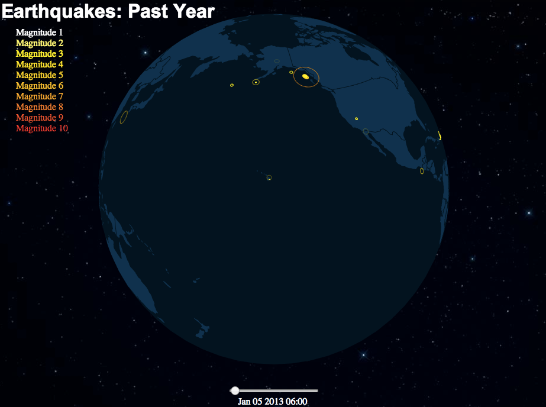

Planetary.js
============

Planetary.js is a JavaScript library for building awesome interactive globes, like this one:



Planetary.js is based on [D3.js](http://d3js.org/) and [TopoJSON](https://github.com/mbostock/topojson). It has built-in support for zoom, rotation, mouse interaction, and displaying animated "pings" at any coordinate. Via plugins, Planetary.js can be extended to do whatever you want!

Examples, documentation, and more can be found at [planetaryjs.com](http://planetaryjs.com/).

Requirements
------------

* [D3](http://d3js.org/) version 3
* [TopoJSON](https://github.com/mbostock/topojson) version 1

Quick Start
-----------

You'll need to run this page from a web server of some kind so that Planetary.js can load the TopoJSON data via Ajax.

HTML:

```html
<html>
<head>
  <script type='text/javascript' src='http://d3js.org/d3.v3.min.js'></script>
  <script type='text/javascript' src='http://d3js.org/topojson.v1.min.js'></script>
  <script type='text/javascript' src='planetaryjs.min.js'></script>
</head>
<body>
  <canvas id='globe' width='500' height='500'></canvas>
  <script type='text/javascript' src='yourApp.js'></script>
</body>
</html>
```

JavaScript (`yourApp.js`):

```javascript
var planet = planetaryjs.planet();
// You can remove this statement if `world-110m.json`
// is in the same path as the HTML page:
planet.loadPlugin(planetaryjs.plugins.earth({
  topojson: { file: 'http/path/to/world-110m.json' }
}));
// Make the planet fit well in its canvas
planet.projection.scale(250).translate([250, 250]);
var canvas = document.getElementById('globe');
planet.draw(canvas);
```

Congratulations! You've rendered your first globe.

Documentation
-------------

In-depth documentation can be found at [planetaryjs.com](http://planetaryjs.com).

License
-------

Planetary.js is licensed under the MIT license. See the `LICENSE` file for more information.
